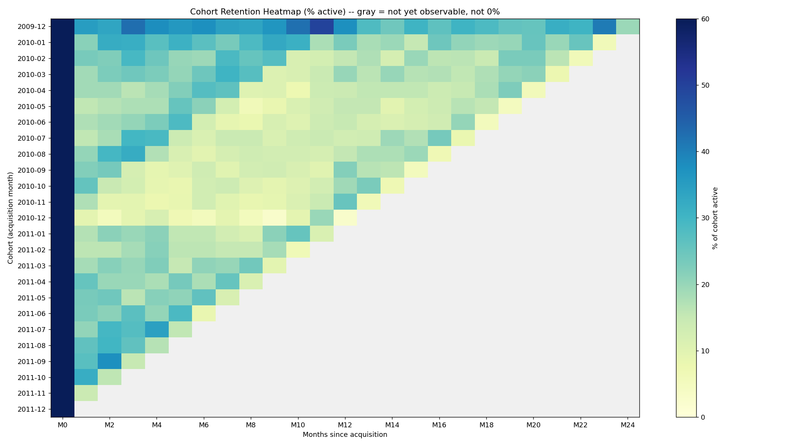
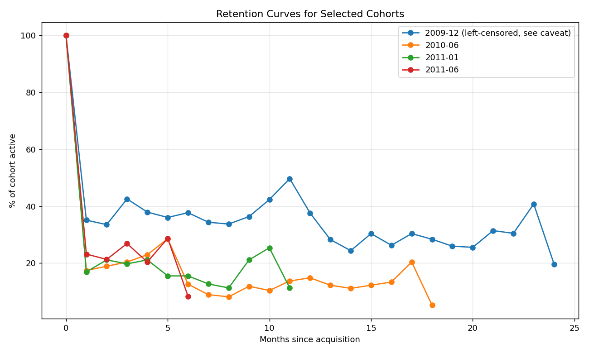
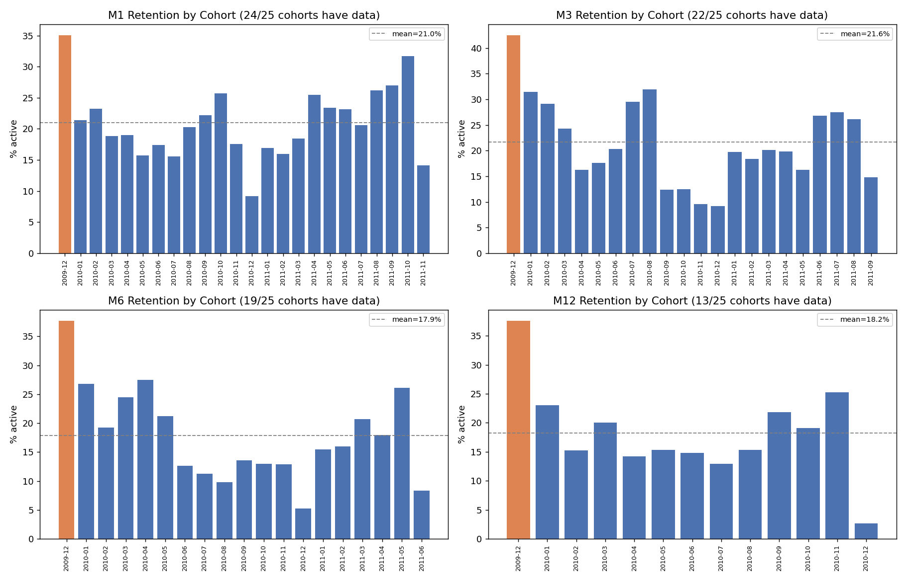

# Phase 12 - Cohort Visualization Report

## Objective

Turn the Phase 11 retention matrix into the three visuals requested, with
every chart continuing to respect the NaN-vs-zero distinction — no
unavailable period is ever rendered as if it were a measured zero.

Implementation: `src/cohort_viz.py`, tested in `src/test_cohort_viz.py`
(3 tests, all passing). Full pipeline: **66/66 tests passing.**

## 1. Cohort Retention Heatmap

Unavailable cells (the upper-right triangle, where a cohort hasn't
existed long enough to reach that month offset) are rendered in light
gray, visually distinct from the color scale used for actual retention
values. This was a deliberate colormap configuration
(`cmap.set_bad(color="#f0f0f0")` applied to a masked array), not a
post-hoc visual trick — the underlying NaN values from Phase 11 flow
straight through.

The heatmap makes two Phase 10/11 findings visible at a glance: the
December 2009 row is visibly darker/higher-retention than every other row
across almost all columns — consistent with the left-censoring finding
(it's not a "better" cohort, it's an artifact of the data window) — and
the triangular gray region in the upper right directly shows how much
less is knowable about recent cohorts.

## 2. Retention Curves for Selected Cohorts

Four cohorts were selected to span the dataset: the flagged 2009-12
cohort, a mid-early cohort with a long observation history (2010-06), and
two more recent cohorts (2011-01, 2011-06) to show shorter-but-still
informative curves. The 2009-12 curve is labeled directly in the legend
as left-censored so a reader can't miss the caveat.

**Visually distinct pattern:** the 2009-12 line sits well above the other
three cohorts for nearly the entire chart, and never truly stabilizes
near zero the way the other cohorts' curves start to by month 5-6. This
is exactly the signature you'd expect from a cohort contaminated with
long-tenured pre-existing customers rather than a genuinely well-retained
acquisition month — visual confirmation of the Phase 10 hypothesis, not
new evidence on its own.

## 3. Milestone Comparison (M1 / M3 / M6 / M12)

Each panel's bar count matches exactly the number of cohorts with real
data at that milestone (24, 22, 19, and 13 respectively, matching Phase
11's table) — cohorts without an observable value are simply absent from
the chart, not shown as a zero-height bar. The 2009-12 cohort is
colored differently (orange vs. blue) in every panel as a visual flag
consistent with its caveat.

All four panels show retention settling into a similar mean band
(17.9%-21.6%) once the 2009-12 outlier is set aside, with no obvious
long-term upward or downward trend visible by eye across the bars — a
first, informal look at the "did retention change over time" question
that Phase 13 will investigate properly with actual evidence rather than
a visual impression.

## What This Means Going Into Phase 13

These charts are descriptive, not yet interpretive — Phase 13 needs to
turn "this is what the data looks like" into "here's what might explain
it," using the Observation → Evidence → Possible Explanation → Business
Implication structure the project calls for, and explicitly avoiding
causal claims the data can't support (e.g. "later cohorts retain worse"
would need more than a visual read of these charts to justify).
