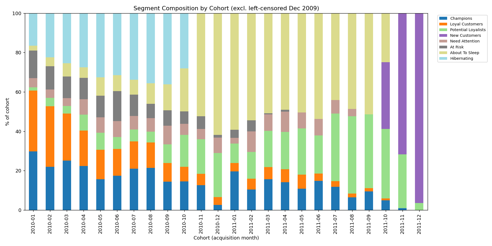

# Phase 14 - Segment × Cohort Analysis Report

## Objective

Connect Phase 7's RFM segments with Phase 10's cohorts, and — critically —
determine whether any observed "some cohorts produce better customers"
pattern is a real business finding or a mechanical artifact of how
Frequency and Monetary are computed.

Implementation: `src/segment_cohort.py`, tested in
`src/test_segment_cohort.py` (6 tests, all passing). Full pipeline:
**77/77 tests passing.**

## Segment Composition by Cohort



(December 2009 excluded from this chart and all analysis in this phase,
consistent with the Phase 10 left-censoring finding.)

The pattern is visually obvious and dramatic: **% Champions declines
almost monotonically from ~30% (2010-01) to 0% (2011-12)**, while %
Hibernating rises from ~17% to 0% over the same period (inverted — very
new cohorts can't be Hibernating either, see below), and % New Customers
rises sharply for the last three cohorts (33.9%, 71.7%, 96.4%).

## The Core Finding: This Is Substantially a Tenure Confound, Not (Only) a Quality Signal

**Observation:** Older cohorts have a much higher share of Champions and
higher average Monetary value than newer cohorts.

**Why this needs scrutiny before being treated as a finding:** Frequency
and Monetary (Phase 5) are **cumulative** measures — total orders and
total spend *ever*. A customer acquired in November 2011 has had at most
one month to place orders before the snapshot date; a customer acquired
in January 2010 has had 23 months. Even if both customers buy at
*exactly the same underlying rate*, the January 2010 customer will show a
much higher Frequency and Monetary simply from having more elapsed time
in which to accumulate purchases — and therefore will be far more likely
to score `F≥4` and qualify as a Champion (Phase 7's rule).

**Evidence, quantified directly (not just asserted):**

```
Full sample (24 cohorts, excl. Dec 2009):
  Spearman corr(cohort age, %Champions)   = 0.863, p = 5.93e-08
  Spearman corr(cohort age, avg monetary) = 0.907, p < 0.0001

Restricted to "mature" cohorts only (12+ months tenure, 12 cohorts):
  Spearman corr(cohort age, %Champions)   = 0.902, p = 6.00e-05
  Spearman corr(cohort age, avg monetary) = 0.825, p = 0.0010
```

**Important nuance — the confound persists even among mature cohorts,
which is itself informative.** Restricting to only the 12 cohorts that
have all had at least 12 months to mature (removing the pure "brand new,
literally no time yet" floor effect) still shows a strong, significant
correlation. This means the pattern is **not simply explained by very
young cohorts having had zero opportunity** — something about it persists
even when every cohort compared has had a full year to build up activity.

**Two competing, non-exclusive explanations, both plausible:**
1. **Mechanical/arithmetic:** even among "mature" cohorts, a 23-month-old
   cohort still has almost twice the elapsed time of a 12-month-old one,
   so cumulative Frequency/Monetary keeps growing with age well past the
   12-month mark — this alone could produce the observed correlation
   without any real behavior change.
2. **Genuine cohort quality change:** it's also possible early cohorts
   (2010) really were more valuable customers on average than later ones
   — but Phase 13 already tested a closely related question (whether
   *retention rate*, not cumulative value, changed by cohort) and found
   **no significant trend** (p=0.191/0.351). Cumulative value and
   per-period retention rate are different things, and this project
   cannot cleanly separate "more calendar time to accumulate" from
   "genuinely better customers" using segment membership alone — that
   would require a tenure-normalized metric (e.g. revenue per
   active-month), which is out of scope for this phase and flagged as a
   possible extension.

**Business implication: do not use raw segment composition by cohort to
claim "early cohorts were higher quality."** The RFM segments as
currently defined are not tenure-adjusted, and this project does not have
strong enough evidence to separate the two explanations above. What CAN
be said with confidence: this is exactly why Phase 7's segments are best
used for *current-state, cross-sectional* targeting decisions
(Phase 20) — "who should we contact right now" — rather than as a
tool for evaluating acquisition-channel or cohort quality over time.

## A Mechanical Validity Check (Not a Business Finding)

Cohorts acquired within the last few months of the dataset (2011-06
onward) show **0% Hibernating** in every case. This is expected and
correct, not a business insight: Hibernating requires `r_score = 1`
(bottom 20% most recent), which requires roughly 400+ days since last
purchase (Phase 7). A customer acquired 6 months before the snapshot date
cannot possibly have gone 400+ days without purchasing — it's
definitionally impossible. Verified directly
(`test_no_hibernating_in_very_new_cohorts`) as a sanity check on the
segment rules, not reported as if it were a discovery about customer
behavior.

## What This Means Going Into Phase 15

Segment × Cohort analysis surfaced an important methodological limitation
rather than a clean business finding: **current RFM segments conflate
"how long has this customer existed" with "how good a customer are
they."** This has a direct implication for Phase 15-16 (CLV): a
probabilistic CLV model (BG/NBD) is specifically designed to account for
a customer's observation window when estimating future value, which is
exactly the correction that simple cumulative RFM segments lack. This
phase's finding is a concrete illustration of *why* CLV modeling adds
value beyond RFM segmentation alone, not just a nice-to-have technique.
