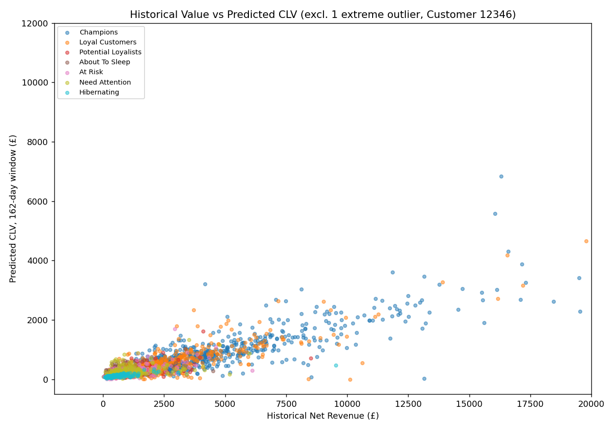

# Phase 18 - RFM × CLV Report

## Objective

Build the combined customer-value view (Segment × Historical Revenue ×
Predicted CLV), and investigate specific cases where RFM segment and
predicted future value disagree — with real customer examples, not
abstract categories.

Implementation: `src/rfm_clv.py`, tested in `src/test_rfm_clv.py` (7
tests, all passing). Full pipeline: **99/99 tests passing.**

## CLV Coverage — Stated Plainly, Not Hidden

Of the 5,868 RFM-valid customers:

| Coverage | Customers | % |
|---|---:|---:|
| Full BG/NBD + Gamma-Gamma prediction | 2,543 | 43.3% |
| Approximated (BG/NBD purchase count × single order value) | 1,532 | 26.1% |
| **No prediction at all — "Not yet measured"** | **1,793** | **30.6%** |

The 1,793 with no prediction are the 952 left-censored December 2009
customers (Phase 15/16 exclusion) plus 841 customers acquired after the
calibration cutoff (2011-06-30), who have no calibration-period history
for BG/NBD to fit on.

## Combined Segment View

| Segment | Customers | Historical Revenue (£) | CLV Coverage | Avg CLV (measured, £) | Total CLV (measured, £) |
|---|---:|---:|---:|---:|---:|
| Champions | 1,266 | 11,530,706 | 60.2% | 1,021.1 | 778,097 |
| Loyal Customers | 847 | 2,614,980 | 73.6% | 535.4 | 333,557 |
| Potential Loyalists | 714 | 687,967 | 56.4% | 119.0 | 47,942 |
| About To Sleep | 1,109 | 522,606 | 76.1% | 69.6 | 58,734 |
| At Risk | 441 | 458,113 | 80.5% | 316.4 | 112,324 |
| Hibernating | 948 | 358,867 | 86.7% | 25.3 | 20,799 |
| Need Attention | 304 | 338,233 | 87.5% | 238.5 | 63,439 |
| **New Customers** | 239 | 79,096 | **0.0%** | — | — |

## A Real Limitation Found, Not a Technical Footnote: Zero CLV Coverage for New Customers

The **New Customers segment has 0% CLV coverage** — not partial, zero.
This is mechanically explained but practically significant: "New
Customers" requires a very recent first purchase (R≥4, F=1 in Phase 7's
rules), and the calibration cutoff (2011-06-30) is fixed. Nearly every
customer who qualifies as "New" relative to the snapshot date (2011-12-10)
was, by definition, acquired *after* the calibration cutoff — meaning
they have no calibration-period history for BG/NBD to fit on at all.

**This is arguably the segment a CRM manager would most want an early
CLV estimate for** (deciding how much to invest in a brand-new customer),
and it's exactly the segment this project's current CLV setup cannot
serve. This is flagged as a genuine scope limitation for Phase 33, with a
suggested resolution (a calibration cutoff closer to the snapshot date,
trading off calibration history length against holdout coverage) rather
than silently ignored.

## Investigating Where RFM and Predicted CLV Disagree

(One extreme outlier, Customer 12346, is excluded from this chart for
readability — see the case study below.)

The overall relationship is positive and expected — customers with
higher historical value tend to have higher predicted CLV — but with
real scatter, and some genuinely interesting individual disagreements:

### Case 1: High RFM score, low predicted CLV — Customer 12695 (Champions)

- Recency: 8 days, Frequency: 7 orders, historical Monetary: £1,371
- Predicted 162-day CLV: **£180.76**

A currently-active, frequent Champion with a comparatively modest
predicted near-term value. This isn't necessarily wrong — it reflects
that this customer's *typical* order size (Gamma-Gamma's estimate) is
modest even though their order *count* is high, and BG/NBD's projected
purchase count for the next 162 days combined with that modest average
value produces a lower CLV than the RFM label alone would suggest. A
segment label captures ordinal rank; CLV tries to capture magnitude —
they can legitimately diverge.

### Case 2: At Risk segment, high predicted CLV — Customer 15749

- Recency: 236 days (stale — hence "At Risk"), Frequency: 3, historical
  Monetary: **£21,536**
- Predicted 162-day CLV: **£9,845.09** (prob_alive: 0.89)

This is exactly the kind of customer Phase 20's retention targeting
should prioritize: RFM correctly flags them as inactive, but the
probabilistic model — which weighs their substantial historical spend
and estimated dropout probability, not just a Recency bucket — still
assigns a high alive-probability and a large predicted value. **A CRM
manager relying on RFM segment alone would see "At Risk" and treat this
customer the same as a low-value At Risk customer; the CLV model
reveals this is a high-priority save, not a routine one.**

### Case 3: The extreme mismatch, and a real modeling limitation it exposes — Customer 12346

- Historical net Monetary: **-£159.18** (negative — scored in the lowest
  RFM Monetary bucket)
- Predicted 162-day CLV: **£16,798.99** — the largest predicted value in
  the entire dataset among customers with a full CLV prediction

Investigating this customer's raw transaction history explains why: on
2011-01-18, they placed a `sale` order for **74,215 units** of "MEDIUM
CERAMIC TOP STORAGE JAR" (line value **£77,183.60**) — then **fully
cancelled it 16 minutes later.** Because the CLV pipeline (Phase 16) fits
BG/NBD and Gamma-Gamma on `sale`-type rows **without netting out
cancellations** (matching the Frequency definition used consistently
elsewhere in this project, but with an unintended consequence here),
this single sold-then-immediately-reversed megaorder is treated by
Gamma-Gamma as a genuine, very large transaction, dramatically inflating
this one customer's estimated average order value and therefore their
predicted CLV. In the actual holdout period, this customer generated
**£0** in revenue (confirmed directly in Phase 17's validation data).

**This is a documented, real limitation of the current CLV modeling
approach, not a data error to quietly fix:** a small number of extreme,
fully-reversed transactions can distort Gamma-Gamma's per-customer value
estimate when that customer has very few (here, 2) calibration-period
transactions. Locked in with a test
(`test_customer_12346_is_the_extreme_mismatch_case`) so this known
limitation stays documented rather than silently disappearing. A future
improvement would fit the CLV models on transaction streams netted of
cancellations, at the cost of added complexity — flagged as an
extension, not built here to avoid further scope creep.

## What This Means Going Into Phase 19

The combined RFM × CLV view gives Phase 19/20 two complementary lenses:
RFM segment for a fast, interpretable status label, and predicted CLV for
a magnitude-aware prioritization signal — and Case 2 above shows why
having both is more useful than either alone for identifying high-value
at-risk customers. Case 3 is a direct, concrete caution for Phase 19's
Revenue-at-Risk calculation: predicted CLV should **not** be summed
naively across all customers without accounting for the fact that a
small number of individual predictions (like Customer 12346's) can be
extreme outliers driven by data artifacts rather than genuine value.
