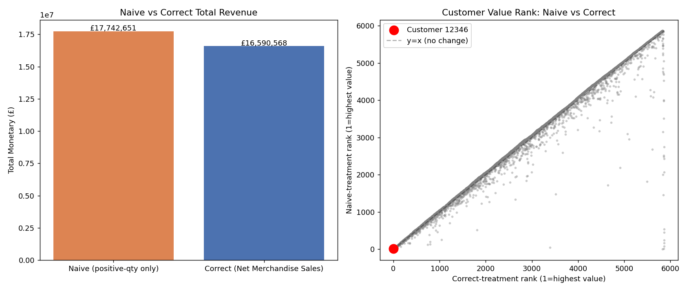

# Phase 22 - Return / Cancellation Impact Analysis Report

## Objective

This is the project's key data-quality demonstration: directly compare a
**naive** pipeline (`df[df.Quantity > 0]`, no transaction classification —
exactly the anti-pattern the project brief calls out) against the
**correct** pipeline (Phases 2-5) on the same raw data, and quantify what
proper cleaning actually changes — for revenue, individual customer
values, and segment membership.

Implementation: `src/naive_comparison.py`, tested in
`src/test_naive_comparison.py` (5 tests, all passing). Full pipeline:
**125/125 tests passing.**

**Isolation of variables:** the naive pipeline keeps the correct
invoice-grain Frequency logic from Phase 4 (that specific mistake — line
items counted as orders — was already exhaustively tested in Phase 4).
This phase isolates **returns/cancellation treatment specifically** as
the one variable under comparison.

## Aggregate Revenue Impact



```
Naive total (positive-quantity rows, unclassified):   £17,742,651.06
Correct total (Net Merchandise Sales):                 £16,590,567.52
Difference:                                             £1,152,083.54
Overstatement:                                                  6.9%
```

Naive treatment **overstates total revenue by 6.9%** — a material, not
trivial, error, because it never subtracts the value of returned goods
(cancellation rows are dropped outright rather than netted against the
sales they reverse) and mixes in non-merchandise charges alongside real
product revenue.

## The Standout Case: Customer 12346's Rank Collapses from #19 to #5,852

This is the same customer flagged as a data-artifact outlier in Phase
18-19 (a 74,215-unit order placed then cancelled 16 minutes later) — this
phase shows exactly what a naive analyst would have concluded about them:

```
                    Naive          Correct
Monetary value:     £77,556.46     -£159.18
Value rank (of 5,868 customers):   #19            #5,852
Segment:            Loyal Customers                At Risk
```

**A naive analysis would flag Customer 12346 as one of the top 20 most
valuable customers in the entire dataset** (top 0.3%) — a natural
candidate for VIP treatment or a loyalty program. **Correct treatment
shows they're one of the least valuable, with negative net revenue** —
they should not be prioritized at all. This single example is the
clearest possible illustration of why the Phase 2 transaction
classification work mattered: without it, this customer would have
directly distorted a top-customer report, a CLV estimate, and a targeting
list.

## Segment Membership Impact

**50 of 5,868 customers (0.85%) change RFM segment** under naive vs.
correct treatment. Full transition list available in
`data/processed/naive_vs_correct.pkl`. Two patterns stand out:

- Most changes involve customers moving **down** in apparent segment
  under correct treatment (e.g. from "Champions" or "Loyal Customers"
  under naive treatment to "Potential Loyalists," "Need Attention," or
  "At Risk" under correct treatment) — consistent with naive treatment
  systematically overstating value by not netting returns.
- **The very highest-volume customers (Champions in both versions,
  e.g. Customer 14911 with a £262,915 naive/correct difference) don't
  change segment** despite enormous absolute £ differences — they're so
  far into the top RFM bracket either way that the segment label doesn't
  move, even though the actual £ figure feeding into revenue reporting,
  CLV, or campaign budgets would be substantially wrong.

**This means segment-membership impact (0.85%) meaningfully understates
the real-world cost of naive treatment** — the £ figures behind Champions
and Loyal Customers can still be wrong by tens of thousands of pounds per
customer even when the segment label survives unchanged.

## Impact on RFM Scores and CLV Inputs (Qualitative, Not a Full Refit)

A full CLV refit under the naive transaction definition was judged out of
scope for this phase (it would require re-fitting BG/NBD + Gamma-Gamma
end-to-end a second time). Instead, the demonstrated impact on Monetary
and segment membership directly implies the CLV impact: since Gamma-Gamma
takes per-customer average transaction value as its core input (Phase
15-16), and Customer 12346's naive-vs-correct Monetary differs by over
£77,000, a CLV model fit on naive (uncancelled) transaction data would
almost certainly have produced an even more extreme, wrong prediction for
this customer than the already-flagged Phase 18 case — reinforcing rather
than contradicting that finding.

## What This Means Going Into Phase 23

This phase provides direct, quantified evidence for the project's central
data-quality thesis: transaction cleaning is not a cosmetic step. A 6.9%
aggregate revenue overstatement and a customer ranked #19 by naive
treatment who is actually #5,852 by correct treatment are exactly the
kind of concrete, board-level-communicable findings that justify the
effort spent in Phases 2-3. Phase 23 (Segment Migration) returns to the
*correct* pipeline going forward — this comparison exists specifically to
document why that pipeline was worth building, not to establish a new
ongoing methodology.
