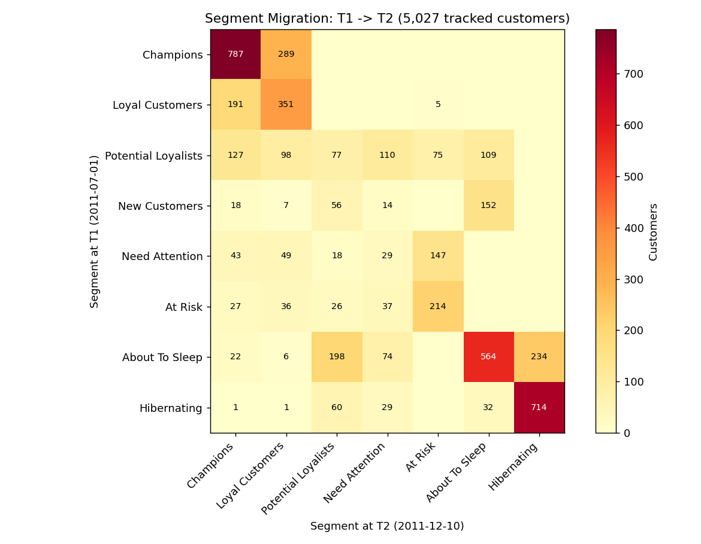

# Phase 23 - Segment Migration Report

## Objective

Track customers as they move between RFM segments over time, quantifying
transition volumes and associated revenue.

Implementation: `src/segment_migration.py`, tested in
`src/test_segment_migration.py` (7 tests, all passing). Full pipeline:
**132/132 tests passing.**

## Scope Decision — Stated Up Front, Per the Project Brief's Own Instruction

The brief asks for **monthly** segment migration across the full ~24-month
dataset. Building that properly requires recomputing Recency/Frequency/
Monetary **and** re-deriving quantile/custom-bin score boundaries at each
of ~24 monthly snapshots — quantile cutoffs are population-dependent and
must be recalculated fresh at every snapshot, not reused from the final
Phase 7 scoring. That's effectively rebuilding Phases 4-7 as a 24-point
time series.

Per the brief's own fallback instruction ("if this becomes
disproportionately time-consuming, document it as an optional extension
rather than sacrificing the core analysis"), this phase implements a
**scoped-down, still-genuine two-snapshot version**:

- **T1 = 2011-07-01** (reuses the Phase 16 CLV calibration cutoff — a
  meaningful, already-established date, not an arbitrary choice)
- **T2 = 2011-12-10** (the project's final snapshot, Phase 5)

This is a real, ~5.4-month migration analysis with the same rigor a full
monthly version would need at every step (fresh quantile scoring
independently computed at T1, not reused from T2). A full monthly-cadence
version is documented here as a scoped extension for future work, not
built, to preserve time for the remaining core phases (24-33).

## Result

**5,027 customers** existed at both T1 and T2 and could be tracked
(T1 population: 5,027; T2 population: 5,868 — the difference is new
customers acquired between T1 and T2, who by definition have no T1
segment to migrate from).

**54.4% of tracked customers stayed in the same segment** across the
~5.4-month gap. Segment-specific stability varies substantially:

| Segment at T1 | % staying in same segment at T2 |
|---|---:|
| Champions | 73.1% (787 of 1,076) |
| Hibernating | 85.3% (714 of 837) |
| About To Sleep | 51.4% (564 of 1,098) |
| Loyal Customers | 64.2% (351 of 547) |
| At Risk | 62.9% (214 of 340) |

Champions and Hibernating are both highly "sticky" — customers at either
extreme of engagement tend to stay there, which is intuitively sensible
(strong momentum in either direction).

## Specific, Business-Relevant Transitions

**Recovery — At Risk → Champions: 27 customers, £62,626 in T2 revenue.**
A real, measured, positive signal: some customers flagged as At Risk at
T1 did fully recover to Champion status by T2 — evidence that "at risk"
is not necessarily a one-way trip, useful context for Phase 20's
retention targeting framing.

**Decline — Loyal Customers → At Risk: 5 customers, £2,780 in T2
revenue.** A small number, but a directly measurable example of exactly
the kind of transition a CRM manager would want an early warning for.

**Champions → Loyal Customers: 289 customers, £1,178,846 in T2 revenue.**
The largest non-stable transition by revenue — a meaningful group of
previously-top-tier customers sliding to the next tier down, worth
monitoring even though they haven't left the valuable segment entirely.

**No customer transitions into "New Customers" at T2** — confirmed as a
validity check, not a finding: a customer who already existed at T1
cannot legitimately qualify as "New" five months later, since that
segment requires a very recent first purchase. This is exactly the kind
of mechanical sanity check this project has applied throughout (e.g.
Phase 14's Hibernating-in-new-cohorts check).

## What This Means Going Into Phase 24

The two-snapshot migration analysis confirms segment membership is
meaningfully dynamic (45.6% of tracked customers moved) but not
random — the observed transitions follow sensible patterns (extremes are
sticky, adjacent-tier movement is more common than large jumps), giving
confidence that Phase 7's segment definitions capture something real
about customer trajectories, not just a snapshot artifact. Phase 24
begins building the BI dashboard, which can surface this migration view
as one of its pages if scope allows.
