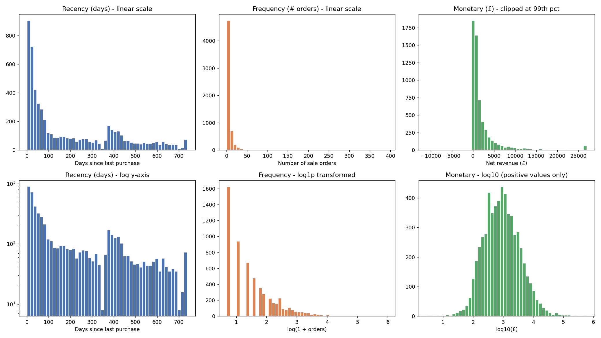

# Phase 6 - RFM Validation Report

## Objective

Investigate the actual RFM distributions before committing to any
segmentation cutoffs. Every extreme value is classified (data error /
legitimate / unusual behavior), not silently dropped. Snapshot-date
sensitivity is tested directly rather than assumed to be fine.

Implementation: `src/validate_rfm.py`. Figure:
`reports/figures/phase6_rfm_distributions.png`.

## 1. Distribution Shape



| Metric | Skewness | Kurtosis |
|---|---:|---:|
| Recency | 0.89 | -0.47 |
| Frequency | 12.53 | 262.20 |
| Monetary | 27.04 | 960.40 |

None of the three are close to normal. Frequency and Monetary are extremely
right-skewed with heavy tails (kurtosis in the hundreds) — a small number
of very high-value/high-frequency customers pull the mean far above the
median (already seen in Phase 5: mean Monetary £2,827 vs. median £853).
**Direct implication for Phase 7:** naive equal-width binning would be
useless here (almost everyone would land in the lowest bin); quantile-based
cutoffs are necessary, but even quantiles may collapse at low Frequency
values given how many customers share Frequency = 1, 2, 3.

Recency's distribution (top-left/bottom-left panels) is not simply
declining — there's a secondary bump around 370-420 days, on top of the
expected concentration near 0. This is worth flagging as a real pattern
(possibly a purchase seasonality or cohort effect, e.g. gift-buying
customers who purchase roughly once a year) — full causal investigation is
out of scope here and belongs in Phase 13 (Cohort Interpretation), not
invented now.

## 2. Extreme Value Investigation (not automatically removed)

### Top Monetary/Frequency customers — classified as **legitimate**
The 10 highest-Monetary customers (£136k–£599k) are also almost all
high-Frequency (51–392 orders) with very low Recency (1–25 days, i.e.
still actively buying). This pattern — many orders, high total spend,
recently active — is consistent with wholesale/B2B buyers, which is
plausible for a giftware wholesaler, not a data error. Kept as-is.

### Most negative-Monetary customers — a mix of **legitimate** and a
### **discovered data-quality artifact**

Investigating the 22 customers with strictly negative Monetary revealed a
recurring pattern: **17 of 22 (77.3%)** have more than half of their
returned value coming from `StockCode 'M'` ("Manual") cancellations that
occur in tight clusters of minutes on the same day. Example — Customer
12918's entire history:

```
C502262   Manual   -1   £10,953.50   2010-03-23 15:20   cancellation
 502263   Manual    1   £10,953.50   2010-03-23 15:22   sale
C502264   Manual   -1   £10,953.50   2010-03-23 15:24   cancellation
```
A sale entered, then cancelled, then re-entered, then cancelled again, all
within 4 minutes. This is far more consistent with a staff member
correcting a data-entry mistake in real time than with a customer genuinely
buying and returning £10,953.50 of merchandise. This pattern recurs (with
different amounts and customers) for at least 3 of the top negative-Monetary
customers checked in detail.

**Classification: most likely a data/process artifact, not a real
economic return.** However, this project does not fabricate a "corrected"
value for these rows — there is no reliable way to distinguish a genuine
rapid buy-then-cancel from a bookkeeping correction using only this data.

**Decision:** retain these rows and customers as-is, flagged as a known
limitation, because:
- The aggregate impact is small: total negative Monetary across all 22
  affected customers is **-£33,239.46**, or **-0.20% of total net
  revenue** — immaterial to any business conclusion at the segment or
  company level.
- Fabricating a "fixed" value would be a bigger analytical risk than
  leaving a well-documented, quantified, small-impact artifact in place.

This is exactly the kind of finding the project brief asks not to hide —
documented here rather than silently smoothed over.

## 3. Snapshot-Date Sensitivity

Recomputed Recency under three alternate snapshot dates (no +1 day offset,
+7 days, +30 days) and compared to the chosen definition:

| Alternate snapshot | % customers same recency quintile | Spearman correlation |
|---|---:|---:|
| No offset (max date itself) | 100.0% | 1.0000 |
| +7 days | 100.0% | 1.0000 |
| +30 days | 100.0% | 1.0000 |

**Result: completely insensitive.** This is mathematically expected — a
constant additive shift to every customer's Recency changes absolute
values but never changes relative ranking, and quintile membership depends
only on rank. **What this does and doesn't tell us:** the specific
snapshot-date offset choice (Phase 5) doesn't affect segmentation, but the
underlying decision to compute Recency from `last_purchase_date` (sale rows
only, not cancellations) still matters a great deal and was not the subject
of this sensitivity test — that decision is validated by construction
(Phase 4/5 grain rules), not by this quantitative check.

## 4. Customers With Returns vs. Without

**42.3% of customers (2,480) have at least one cancellation order.**
Comparing them to customers with zero cancellations:

| | No returns (median) | Has returns (median) |
|---|---:|---:|
| Recency (days) | 178.0 | 54.5 |
| Frequency (orders) | 2.0 | 6.0 |
| Monetary (£) | 485.55 | 1,991.52 |

Both differences are statistically significant (Mann-Whitney U test,
p ≈ 0 for both Frequency and Monetary — not surprising given the very
large sample, but the effect size is also large in practical terms, not
just statistically detectable).

**Interpretation — counter-intuitive and worth stating plainly:**
Customers who have returned something are *not* worse customers. They buy
more often, spend more, and are more recently active than customers who
never return anything. This makes sense mechanically — more purchase
occasions create more opportunities to return something — but it means
**"has returned an item" should not be treated as a negative signal** in
segmentation or campaign targeting. This is an important guardrail for
Phase 7+.

## 5. Single-Purchase Customers (Frequency = 1)

**1,624 customers (27.7%)** made exactly one order in the ~2-year window.

| | Single-purchase (median) | Multi-purchase (median) |
|---|---:|---:|
| Recency (days) | 387 | 60 |
| Monetary (£) | 227.55 | 1,346.68 |

This is a large, distinct population: mostly inactive (median recency of
387 days — over a year since their only purchase) and low-value. They
can't sensibly be blended into the same Frequency quintile logic as
everyone else without checking, in Phase 7, whether quintile cutoffs
actually separate this group cleanly or collapse several quintile
boundaries onto Frequency = 1 (with 27.7% of the population at a single
value, this is a real risk that needs to be checked, not assumed away).

## What This Means Going Into Phase 7

1. Quantile-based scoring is necessary (confirmed by skew), but naive
   quintiles risk collapsing at low Frequency values — must be checked,
   not assumed.
2. The negative-Monetary artifact (17 customers, -0.20% of revenue) is
   immaterial and does not require special handling in segmentation, but
   is now documented for anyone auditing the numbers.
3. "Has returns" must not be used as a proxy for "bad customer" — the
   data says the opposite.
4. The 27.7% single-purchase population needs explicit attention in
   segment design — likely its own segment rather than being spread across
   multiple quintile-based buckets.
5. Snapshot date choice is confirmed robust and does not need revisiting.
