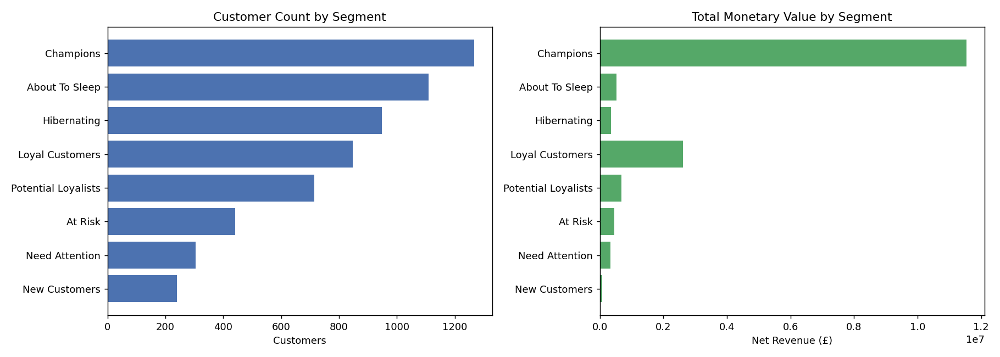

# Phase 7 - RFM Segmentation Report

## Objective

Build interpretable 1-5 scores for Recency, Frequency, Monetary and map
them to business-labeled segments, backed by explicit measurable rules --
not assumed quintiles, not forced labels.

Implementation: `src/segment.py`, tested in `src/test_segment.py` (10
tests, all passing). Full pipeline: **38/38 tests passing.**

## Recency and Monetary: standard quantiles worked cleanly

Phase 6 confirmed both are near-continuous (592 and 5,768 distinct values
respectively across 5,868 customers). `pd.qcut` at 5 bins produced 5
evenly populated groups for both (~1,170-1,215 customers each, ~20% per
bin) — no adjustment needed.

## Frequency: quantiles failed, so custom business bins were used instead

**What we tried first (per the project's instruction to start with
quantiles):** `pd.qcut(frequency, 5)`. **Result: it collapsed to only 4
effective bins** (edges `[1, 2, 4, 8, 392]`), because 69.4% of customers
have Frequency ≤ 5 and only 87 distinct Frequency values exist across
5,868 customers. Requesting 4 or 3 bins collapsed further, to only 3
effective bins each. This is a direct, measured consequence of the
27.7%-single-purchase spike flagged in Phase 6.

**Why not force 5 equal bins with rank-based tie-breaking:** this was
considered and rejected. It would have split the 1,624 customers who all
bought exactly once across two or more different score buckets based on
arbitrary tie-breaking order — manufacturing a distinction the data does
not support. A customer with exactly 1 order is not meaningfully different
from another customer with exactly 1 order.

**What was used instead — fixed, business-interpretable breakpoints:**

| Score | Orders | Customers | % |
|---|---|---:|---:|
| F=1 | 1 | 1,624 | 27.7% |
| F=2 | 2 | 941 | 16.0% |
| F=3 | 3-4 | 1,151 | 19.6% |
| F=4 | 5-9 | 1,186 | 20.2% |
| F=5 | 10+ | 966 | 16.5% |

All 5 bins land between 16.0% and 27.7% — reasonably balanced, and every
boundary corresponds to a business-readable idea ("bought once," "bought
twice," "bought a handful of times," "regular," "frequent"). This is
labeled an **assumption** — a defensible reading of purchase count, not a
statistically optimal cutoff. Phase 8/9 will test whether it produces
meaningfully different customer behavior and how sensitive segment
membership is if these cutoffs move.

## Segment Assignment Rules

Applied as an ordered waterfall (first matching rule wins), covering all
5×5×5 = 125 possible R/F/M score combinations with no gaps (verified by
`test_segment_rules_are_mutually_exclusive_and_exhaustive`, which checks
every combination gets a non-empty label):

| Order | Rule | Segment |
|---|---|---|
| 1 | R≥4 and F≥4 and M≥4 | Champions |
| 2 | F≥4 and M≥3 | Loyal Customers |
| 3 | R≥4 and F∈{2,3} | Potential Loyalists |
| 4 | R≥4 and F=1 | New Customers |
| 5 | R≤2 and F≥3 | At Risk |
| 6 | R∈{2,3} and F≤2 | About To Sleep |
| 7 | R=1 and F≤2 | Hibernating |
| 8 | (anything remaining) | Need Attention |

`Need Attention` is an explicit, deliberate catch-all for score
combinations that don't fit a clean narrative (e.g. R=3, F=3, M=2) — not a
silently-dropped residual.

## Measured Results

| Segment | Customers | % of customers | Total Monetary (£) | % of Monetary |
|---|---:|---:|---:|---:|
| Champions | 1,266 | 21.6% | 11,530,710 | 69.5% |
| Loyal Customers | 847 | 14.4% | 2,614,980 | 15.8% |
| Potential Loyalists | 714 | 12.2% | 687,967 | 4.1% |
| About To Sleep | 1,109 | 18.9% | 522,606 | 3.2% |
| At Risk | 441 | 7.5% | 458,113 | 2.8% |
| Hibernating | 948 | 16.2% | 358,867 | 2.2% |
| Need Attention | 304 | 5.2% | 338,233 | 2.0% |
| New Customers | 239 | 4.1% | 79,096 | 0.5% |

## Interpretation

**The Pareto pattern here is extreme, not the usual "80/20" rule of
thumb — it's closer to 22/85.** Champions are 21.6% of customers but
**69.5% of total historical value**; Champions + Loyal Customers together
are 36% of customers and **85.3%** of value. This one number should anchor
the entire retention strategy conversation in later phases: protecting
the Champions/Loyal population matters far more, in raw £ terms, than
almost anything else this project could recommend.

**At Risk (441 customers, £458k) is a materially real group**, not a
rounding error — these are customers who were frequent/valuable buyers
(F≥3) but haven't purchased recently (R≤2). This is the natural first
candidate list for retention campaigns in Phase 20.

**About To Sleep and Hibernating together are 35.1% of customers but only
5.4% of value** — a large population that would be expensive to target
broadly and contributes comparatively little revenue at risk.

## What Has NOT Yet Been Validated

This phase only checked that segments are non-trivially populated. It has
**not yet** checked:
- Whether segments are statistically/meaningfully different in behavior
  beyond the scores that define them (Phase 8)
- How sensitive segment membership is to moving the quantile/bin cutoffs
  (Phase 9)

No claim is made yet that these 8 segments are the "right" or final
segmentation — that determination is explicitly deferred to Phases 8-9.
